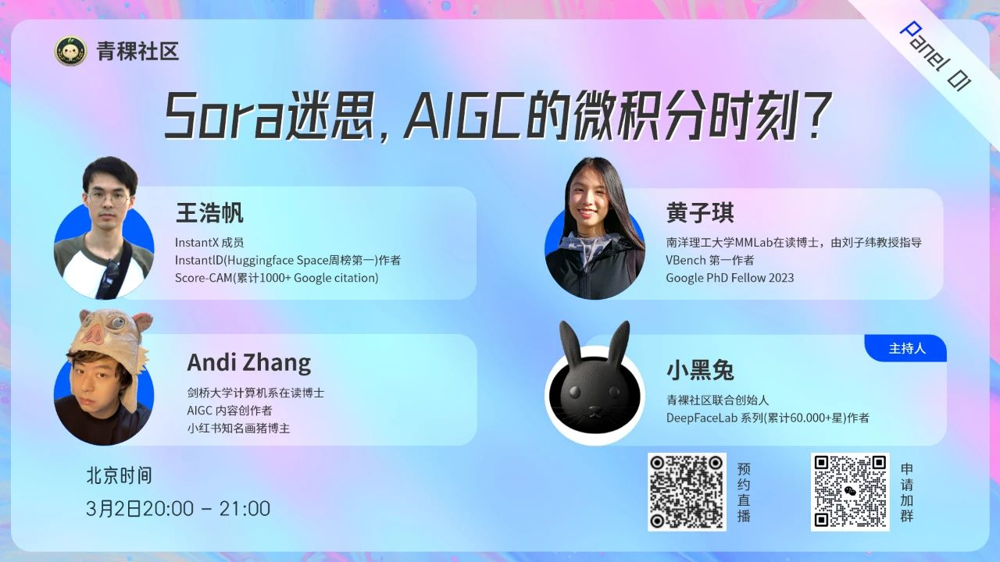

最近，无论是 OpenAI 的 Sora 模型，还是 Stability AI 的 Stable Diffusion 3 ，都让我们看到了生成模型方面的突破。这也让我们不禁思考：AIGC 领域的微积分时刻是否已经到来？

3月2日晚8点，青稞社区策划推出【青稞Panel】第一期，并邀请到DeepFaceLab(累计60,000 +⭐️)作者小黑兔、InstantID(huggingface space周榜第一)作者王浩帆、剑桥大学计算机系在读博士Andi Zhang和VBench 第一作者、南洋理工大学MMLab在读博士黄子琪参与，共同探讨《Sora迷思，AIGC的微积分时刻?》。

# 参与嘉宾

王浩帆，CMU(卡耐基梅隆)硕士毕业，InstantX成员，代表工作InstantID(huggingface space周榜第一，Yann Lecun转发点赞)，Score-CAM(累计1000+ google citation)，发表过 NeurIPS、CVPR、ICCV、3DV 等多个领域顶级会议。

Andi Zhang，剑桥大学计算机数学双硕士，剑桥大学计算机系博士生在读，研究方向涵盖贝叶斯神经网络，概率生成模型，分布外检测以及对抗样本生成；AIGC 内容创作者，小红书知名画猪博主。

黄子琪，南洋理工大学MMLab在读博士，由刘子纬教授指导；广泛关注计算机视觉和深度学习领域，目前研究重点是生成模型、视觉生成和编辑，在CVPR、ICCV、ICIP 等会议上发表过多篇论文。Google PhD Fellow 2023。本科于2022年以专业第一的成绩毕业于南洋理工大学EEE学院。

小黑兔（Panel主持人）, 青稞社区联合创始人, 代表工作换脸软件DeepFaceLab系列(累计60,000 +⭐️), PyTorch/Tensorflow contributor，发表过NeurIPS、 CVPR、3DV等多个领域顶级会议。

# 分享时间

3月2日（周六） 20:00 - 21:00

# 参与方式

本次 Panel 将在腾讯会议进行，扫码对暗号：“Sora”，获取会议链接！

